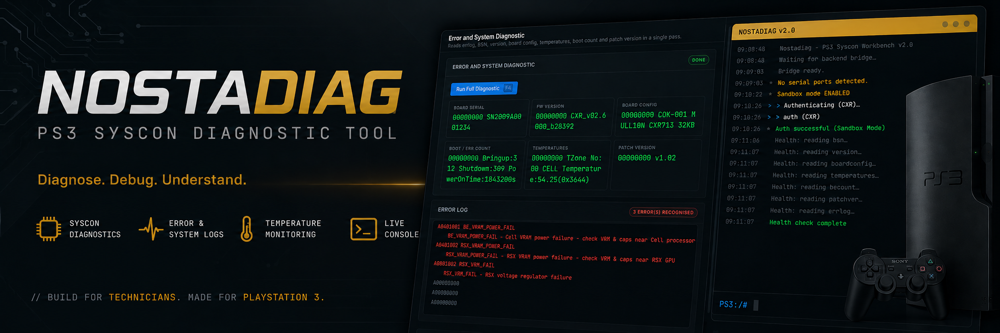
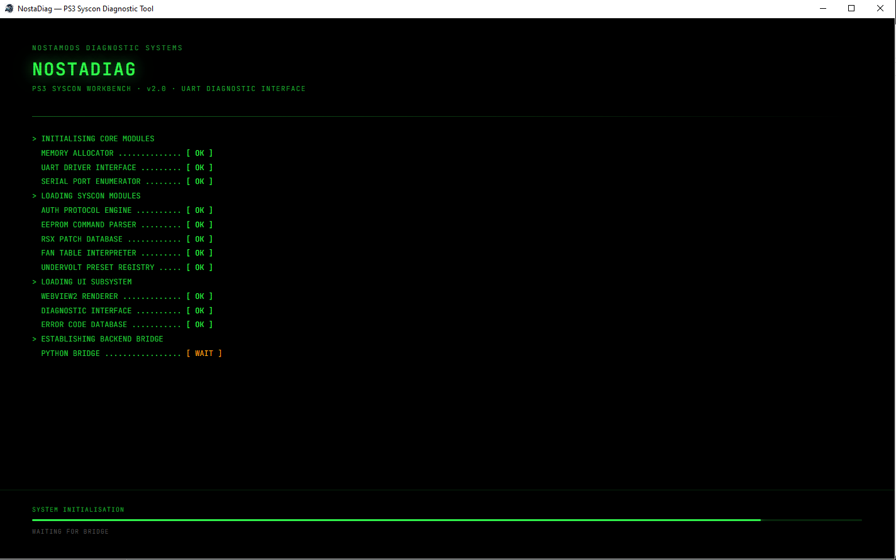
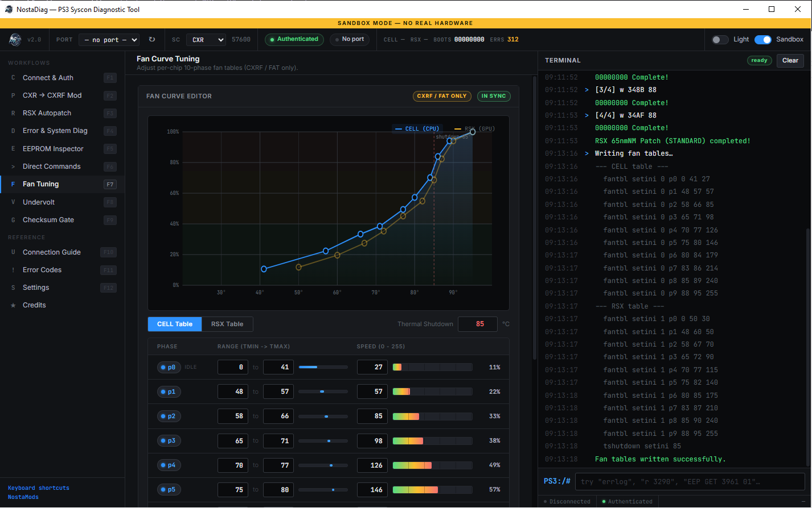
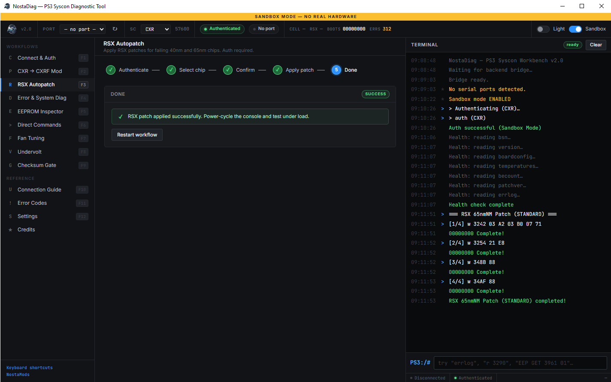
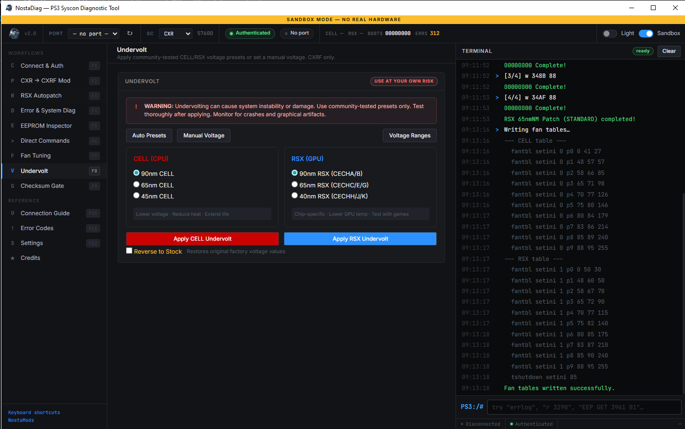
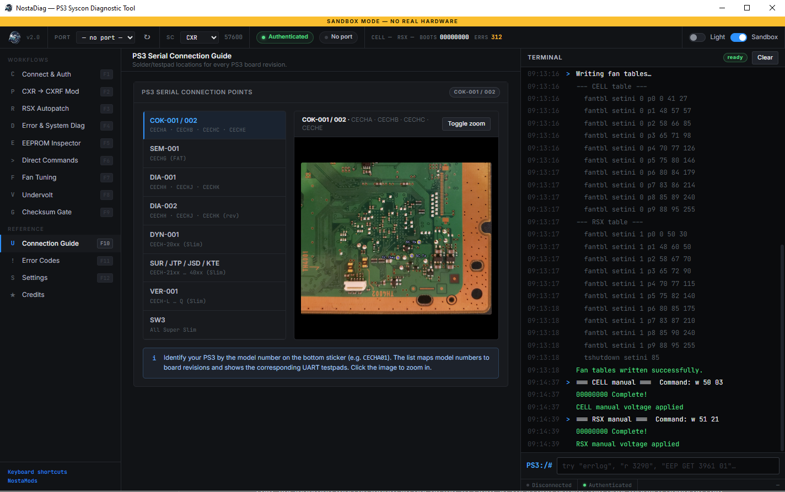
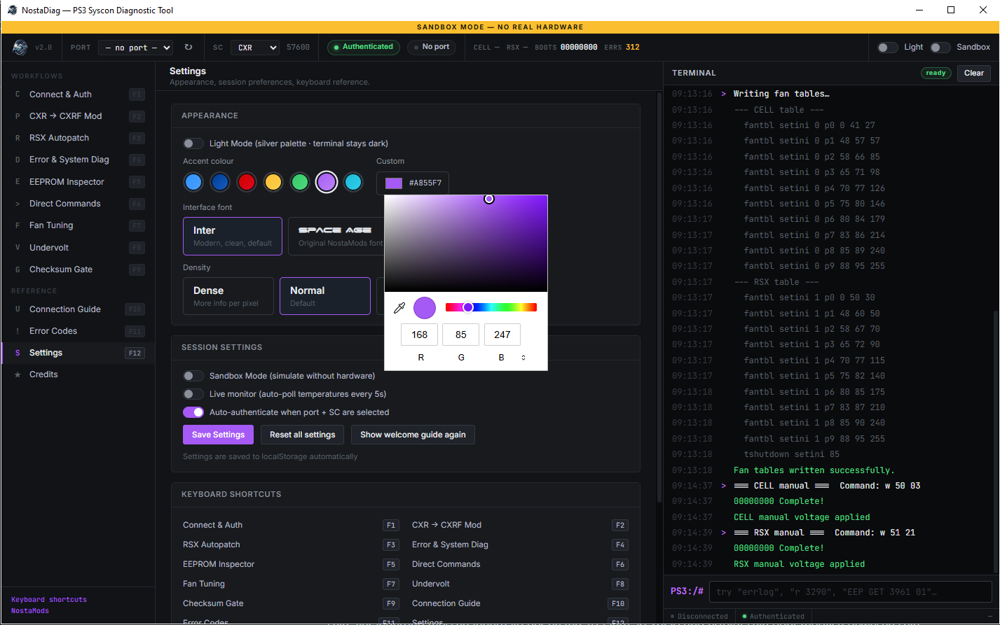

# NostaDiag V2.0

> A modern diagnostic and repair tool for PS3 Syscon operations built by NostaMods.

> **Engineering Preview — test thoroughly before using on important hardware. No warranty provided.**

---

## Overview

NostaDiagV2 is a standalone Windows GUI for PS3 Syscon work via UART serial.
No Python required. No terminal commands. No guessing — just a clean interface that covers everything from a quick health check to full fan curve editing and chip undervolting.

V2 is a complete rewrite. The old tkinter interface was functional but rigid — fixed layouts, no real responsiveness, limited to what the widget library could do. I build V2 with the help from Claude so it runs in a modern web engine, which means a proper visual design, real interactivity, and an experience that actually matches the complexity of the work you're doing with all the Help you need.

**Requires:** A UART-TTL adapter (CP2102, CH340, FT232, etc.) connected to the PS3 Syscon testpads.

---

## Features at a Glance

| Feature | Description |
|---|---|
| Health Check | Full diagnostic read — BSN, firmware version, board config, temps, error log, boot count |
| RSX Autopatch | One-click RSX patching for 40nm and 65nm chips, Standard and GGB variants |
| CXR to CXRF | Convert Syscon mode — automatic read, patch, and verify |
| Checksum Correction | Auto-detect wrong checksums and apply the correct write commands |
| Checksum Gate | Disable/enable the checksum gate for EEPROM writes |
| EEPROM Inspector | Read and write raw memory at any address and length |
| Fan Curve Editor | Full CELL + RSX fan table editing, 10 phases each, with thermal shutdown control |
| Fan Presets | Stock, Quiet, and Performance profiles — apply in one click |
| Undervolting | CELL and RSX voltage control via nm-node presets or manual VID slider |
| Direct Commands | Send raw UART commands and read the response directly |
| Connection Guide | Built-in testpad images for all PS3 models |
| Error Codes | Full PS3 Developer Wiki error reference, built-in |
| Sandbox Mode | Full simulation — test everything without connected hardware |
| Persistent Settings | Theme, font, accent color — all saved between sessions |

---

## Screenshots

| Startup | Fan Tuning |
|---------|------------|
|  |  |

| RSX Autopatch | Undervolting |
|---------------|--------------|
|  |  |

| Connection Guide | Settings |
|-----------------|----------|
|  |  |

---

## Requirements

### Hardware
- PS3 console (FAT, Slim, or Super Slim)
- UART-TTL adapter at 3.3V logic level — **do not use 5V**
- USB cable

### Software
- Windows 10 or Windows 11
- No Python installation required (standalone .exe)

---

## Installation

Download `NostaDiag_v2.0_Setup.exe` from [Releases](../../releases) and run it.

Settings are stored in `%APPDATA%\NostaDiag\` — no admin rights needed after install.

For detailed setup including hardware wiring, driver installation, and first-launch steps, see [INSTALL.md](INSTALL.md).

---

## Quick Start

1. Connect UART adapter to PS3 Syscon testpads (TX→RX, RX→TX, GND→GND)
2. Select the correct **COM port** and **SC Type**
3. Click **Auth PS3** before any patching operations
4. Use **Sandbox Mode** to explore the interface without connected hardware

> Use the built-in Connection Guide to find the correct testpads for your PS3 model.

---

## Safety Features

- **Auth gate** — patching operations are locked until Syscon authentication succeeds
- **Sandbox mode** — full dry-run, no UART traffic sent
- **Checksum correction** — auto-detect and fix EEPROM checksums after writes
- **Temperature validation** — fan curve phases must be ascending, TMax > TMin enforced
- **Voltage reference** — built-in VID table and voltage range chart per chip revision

---

## Credits

Built on community reverse engineering work:

- **M4j0r** — foundational work on PS3 Syscon internals, UART protocol, and diagnostic commands
- **Sage** — reverse-engineered authentication methods and Syscon security mechanisms
- **DoublesAdvocat** — research and documentation of safe voltage ranges per chip revision
- **Calyps0man** — UI feedback, visual design input, testing, and research contributions to the Frankenstein mod
- PSX-Place community — Frankenstein mod documentation and RSX swap research
- Reference: [Frankenstein PHAT PS3 CECHA with 40nm RSX](https://www.psx-place.com/threads/frankenstein-phat-ps3-cecha-with-40nm-rsx.28069/)

---

## License

[NostaDiag License v1.0](LICENSE.txt)

Personal, educational and repair use is permitted. Commercial use requires visible credit.
Do not rebrand, remove credits, or redistribute modified versions without attribution.

---

## Links

- Instagram: [@NostaMods](https://www.instagram.com/nostamods/)
- Issues: [GitHub Issues](../../issues)

---

*Made with care for the PS3 modding community — NostaMods*
*V2 built with [Claude Code](https://claude.ai/code)*
